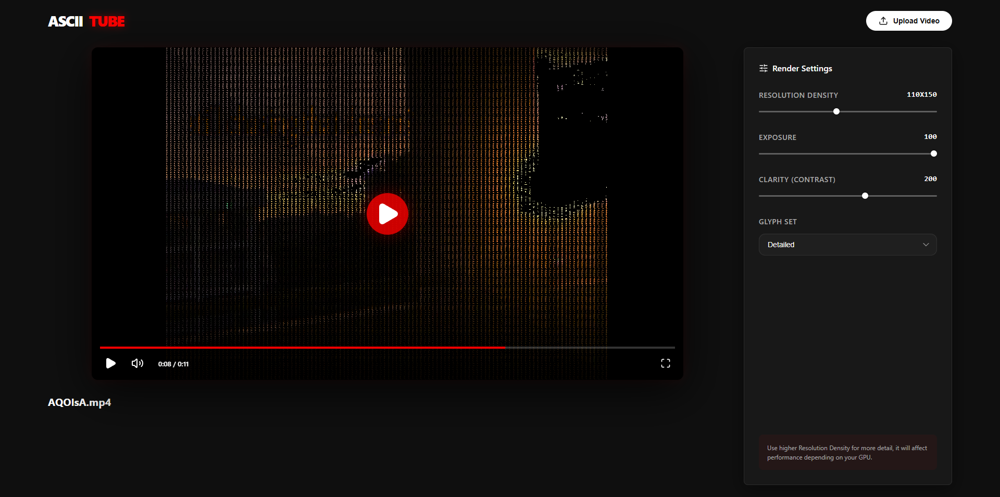

# 🎬 ASCII-TUBE



**ASCII-TUBE** is a high-performance, WebGL-powered web application that transforms standard video files into stunning ASCII art in real-time. Experience your favorite videos through a retro-modern lens with granular control over rendering aesthetics.

## ✨ Features

- **🚀 Real-time WebGL Rendering**: High-performance ASCII conversion using custom GLSL shaders, ensuring smooth 60 FPS playback even at high resolutions.
- **📁 Drag & Drop Support**: Seamlessly upload and play local video files by dragging them directly into the player.
- **🎛️ Dynamic Render Settings**:
  - **Resolution Density**: Adjust the "pixel" size of the ASCII characters.
  - **Exposure & Clarity**: Fine-tune brightness and contrast for the perfect character mapping.
  - **Glyph Sets**: Choose between Standard, Detailed, Binary, or Pixel-style character sets.
- **🎹 Keyboard Shortcuts**:
  - `Space`: Play / Pause
  - `M`: Toggle Mute
- **📱 Responsive Design**: Fully optimized for both desktop and mobile viewing.
- **🖥️ Fullscreen Mode**: Immerse yourself in the ASCII experience with one click.

## 🛠️ Tech Stack

- **Core**: [Next.js 15+](https://nextjs.org/), [React 19+](https://react.dev/)
- **Logic**: [TypeScript](https://www.typescriptlang.org/)
- **Graphics**: WebGL & GLSL Shaders
- **Icons**: [Lucide React](https://lucide.dev/)
- **Styling**: Vanilla CSS (CSS Modules & Global Styles)

## 🚀 Getting Started

### Prerequisites

- Node.js 18.0 or later
- A modern browser with WebGL support

### Installation

1. **Clone the repository:**
   ```bash
   git clone https://github.com/realSalman/ascii-video-player-webapp.git
   cd ascii-video-player-webapp
   ```

2. **Install dependencies:**
   ```bash
   npm install
   ```

3. **Run the development server:**
   ```bash
   npm run dev
   ```

4. **Open your browser:**
   Navigate to [http://localhost:3000](http://localhost:3000) to see the application in action.

## 📖 Usage

1. **Upload a Video**: Click the "Upload Video" button or drag a `.mp4`, `.webm`, or `.mov` file into the player area.
2. **Adjust Settings**: Use the sidebar to change the resolution, exposure, and glyph sets in real-time.
3. **Playback**: Use the standard controls or keyboard shortcuts to manage playback.

## 🛡️ License

Distributed under the MIT License. See `LICENSE` for more information.
